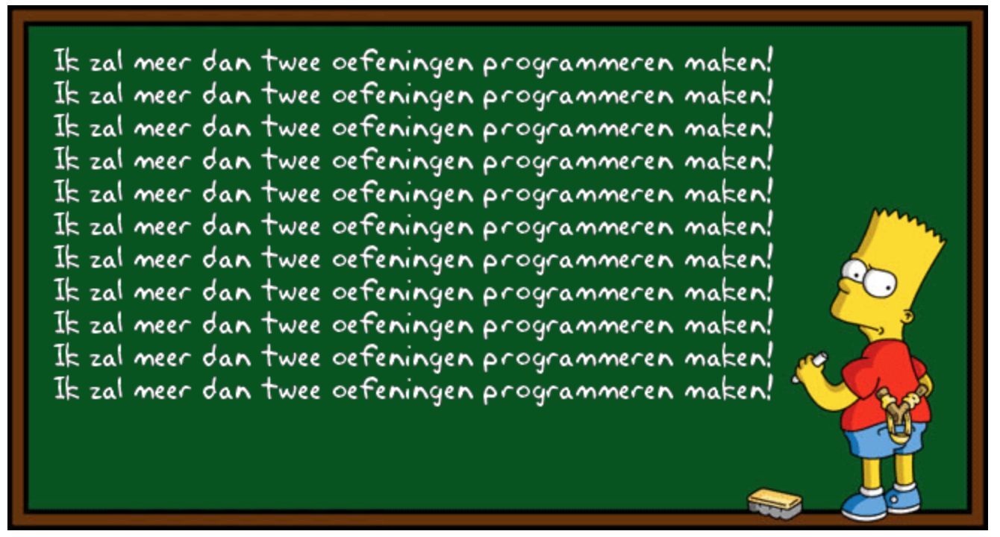

## Bart simpson

Bart Simpson is een personage uit de animatieserie The Simpsons. In de opening sequence van een episode zie je Bart Simpson straf schrijven op een schoolbord. Zijn toets van programmeren was namelijk niet zo goed en de leerkracht wil hem laten nablijven zoals in 'The good old day's'.


{:width="70%"}

### Opgave

Schrijf een programma die de tekst op het bord schrijft. Het programma vraagt aan de gebruiker hoeveel keer Bart zijn strafzin moet schrijven. Het minimumaantal is 1.

### Invoer

Een geheel getal groter dan 1

### Uitvoer

x-aantal keer de tekst "Ik zal meer dan twee oefeningen programmeren maken!"

### Voorbeeld

#### Invoer:

```
3
```

#### Uitvoer:

```
Ik zal meer dan twee oefeningen programmeren maken!
Ik zal meer dan twee oefeningen programmeren maken!
Ik zal meer dan twee oefeningen programmeren maken!

```
